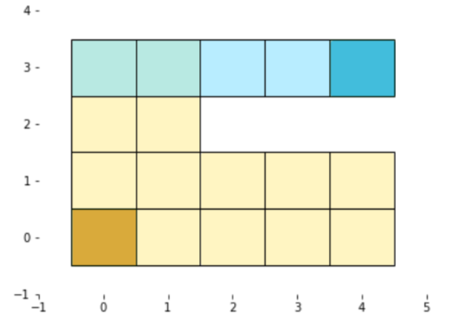

# Introduction

Implemented a Bayesian model to infer beliefs and desires about an agent given an observed position trajectory sequence. 

_This project replicate the results of Baker, Saxe, Tenenbaum (2011) and Baker, Jara-Ettinger, Saxe, Tenenbaum (2017) with some simplifying assumptions. This draws from their concrete example of a hungry graduate student looking for lunch at one of the food trucks on campus:_

There are three food trucks that come to campus, each serving either Korean food, Lebanese food, or Mexican food. The university provides only two parking spots, so at most two trucks can be on campus on any given day; parking spots will never be empty and there is only one truck for each cuisine type. When the student leaves her office, she can see the truck parked in the near spot in the southwest corner of campus. The other truck is parked in the northwest corner of campus is around a set of buildings and is not visible unless the student walks around the corner to see what is there.


Based on the agent’s positional trajectory, an observer can model at different time points, what the student believes to be true about the world and the student’s relative food preferences (desires). The program will be given a couple of state trajectories in possible worlds and asked to model a theory of mind inference about the beliefs and desires of the agentas an observed.

# Skills

* Value Iteration
* POMDP
* Sequential Bayesian Inference

# Inputs:

* **State Trajectiries**: a list of positions an agent is observed to be in for a time sequence.
* **World**: the world in which the observer saw the agent take those steps.
* **Environmen**: The state space and action space.
* **Reward Values**: the numeric costs and rewards for different states.

# Setup
Here is the 2D visualization of a simplified food truck environment.  The trucks are located in position `(0,0)` and `(4,3)`. The shading on the image correspond to which positions certain trucks are visible in (where the agent will receive observations). Observations are recieved with probability 1 and always correct. There is no chance the agent will be mistaken about which truck is in the location once she is in a position to see it.

Figure 1: POMDP Environment: Truck 1 Location in mustard and positions where truck 1 is visible in `yellow`. Truck 2 location in `blue` and positions where truck 1 is visible are lighter blue.

The agent knows its position on the grid but there is uncertainty about which trucks are parked in which spots until after observations are received. There are six possible worlds: KL, KM, LK, LM, MK, ML. The first letter corresponds to the truck in position (0,0) and the second to the truck in (4,3).

### State Representation:
States are now tuples of form: ((position), (belief state)), where position is (x,y) the coordinate on the 2-D environment grid, and the belief state is a tuple of length 6 where each position is the probability the agent is that world. The worlds are: KL, KM, LK, LM, MK, ML, in that order. For example, if the agent knows it is in world KL with probability 1, its belief state will be (1,0,0,0,0,0,0). If it knows the tuck in position (0,0) is a L, its belief state is (0,0,.5,.5, 0,0), etc. 

### Desires and rewards
Desires are equivalent to preference rankings. There are six possible ways to rank the three types of food. The type of the food that is most preferred will be given a reward of 100, the type of food that is in the middle should be constructed to have a reward of 75 and the least preferred food has a reward of 50. All actions should have a cost of -1 except stay (0,0), which has the reward of -.1. We are in charge of constructing reward tables and belief rewards from this information. The final belief reward will be of form 

``` (python)
{ state : { action { next state: ρ(state, action) }}}

```

### Transition
The position transition of the agent is deterministic (the intended action is always taken with probability 1 if possible in the environment, otherwise the agent stays in the same position). The belief transition (unlike before) is not conditioned on which particular observation is received, but rather is able to plan for any possible observation that might occur. We assume all observations are equally probable. This means that our belief transition should map to multiple next possible beliefs when new information is received, one belief for each possible instance the observed truck could take. That is, if we had no information before and then receive the observation of the first truck our set of next possible beliefs should include the three belief states where the first truck is known but the second is not.

### Policy
POMDP policy will be generated once for each desire using the belief transition and belief reward generated for that preference set, no matter which world the agent is in. That is, the policy should be a mapping from position and belief state to action for any truck combination that it is possible to observe. This will result in 6 policies that together can take any possible belief state, position, and preference set and return the actions to take.

### Inference
Inferences about the agent’s beliefs are deterministic, because the observations the agent receives always occur within the visible zone and are always correct. 


# Result

* See the `beliefDesireInference.ipynb` 

